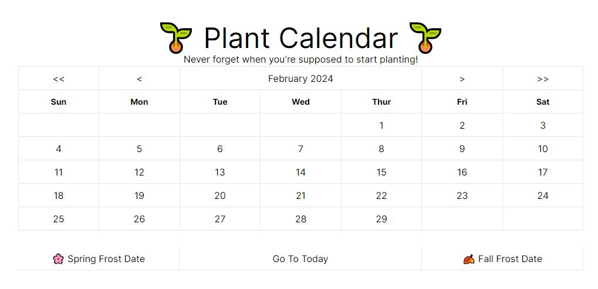

# Plant Germination Calendar Documentation

## Overview

The Plant Germination Calendar is an interactive tool designed to help gardeners understand the optimal times to start the germination process for various plants.

## Features

- **Plant Selection**: Users can select from a wide range of plants, including vegetables, fruits, flowers, and herbs.
- **Customizable Zones**: The calendar adjusts germination times based on the user's specific geographic location or hardiness zone.
- **Temperature Guidelines**: Offers insights into the ideal soil temperatures for germination of selected plants.
- **Germination Timelines**: Displays a timeline from germination to transplantation, including key milestones like sprouting and hardening off.
- **Reminder System**: Users can opt-in for reminders via email or mobile notifications for starting seeds or transplanting seedlings.

<!-- ## How to Use the Calendar

1. **Select Your Location**: Input your geographic location or select your hardiness zone to customize the calendar to your climate.
2. **Choose Plants**: Select the plants you intend to grow. You can select multiple plants to plan your entire garden.
3. **View Germination Schedule**: The calendar will display a schedule, showing the optimal window for starting germination indoors or directly sowing seeds outdoors.
4. **Follow Temperature Guidelines**: Pay attention to the recommended soil temperatures for each plant, ensuring conditions are ideal for germination.
5. **Set Reminders**: Opt to receive reminders for each plant selected to ensure you don't miss the optimal germination window. -->

<!-- ## Interpreting the Calendar

- **Color Coding**: The calendar uses color coding to represent different stages of the germination process. For example, green indicates the start of germination, while yellow could represent the hardening off period.
- **Date Ranges**: Specific date ranges are provided for starting germination. These are calculated based on historical climate data and should be used as a guideline.
- **Icons & Symbols**: Icons may be used to denote specific actions or notes, such as watering needs, transplanting, or additional care instructions. -->

## Tips for Success

- **Monitor Soil Temperature**: Use a soil thermometer to ensure soil conditions are within the recommended range for germination.
- **Start Indoors When Necessary**: For plants with longer growth cycles or in regions with short growing seasons, starting seeds indoors can provide a head start.
- **Gradual Acclimatization**: Gradually acclimate indoor-started plants to outdoor conditions over a week to prevent shock.
- **Record Keeping**: Keep a gardening journal to record germination and planting dates, along with observations and outcomes. This can be invaluable for planning future gardens.

